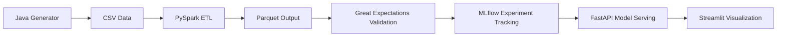
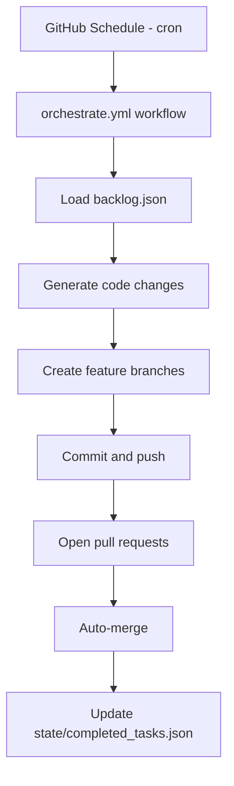

# Data Engineering Project Evolver

A production-grade system demonstrating a complete data engineering workflow: ingestion, transformation, validation, machine learning, model serving, and visualization, with reproducible infrastructure.

---

## Overview

The Data Engineering Project Evolver simulates an end-to-end e-commerce analytics platform. Key capabilities include:

* **Data Ingestion:** Java-based generator produces synthetic CSV sales data
* **ETL Pipelines:** PySpark jobs normalize, aggregate, and transform datasets
* **Data Quality:** Great Expectations enforces schema and constraint validation
* **Machine Learning:** MLflow tracks experiments and model artifacts
* **Model Serving:** FastAPI exposes models through REST endpoints
* **Visualization:** Streamlit dashboards display insights
* **Infrastructure:** Terraform provisions local services (Postgres, MinIO, Redis)
* **Testing & CI/CD:** Unit tests, type hints, logging, and GitHub Actions workflows

---

## Repository Structure

```
.
├── .github/
│   └── workflows/           # GitHub Actions for CI and automation
├── api/                     # FastAPI service
├── dashboard/               # Streamlit dashboards
├── data_pipelines/          # PySpark ETL jobs
├── infra/                   # Terraform infrastructure code
├── java_generator/          # Java data generator (Maven)
├── mlflow/                  # MLflow experiments
├── quality/                 # Great Expectations validation suites
├── scripts/                 # Orchestration and utility scripts
├── tests/                   # pytest test suite
├── state/                   # JSON state for task tracking
├── .gitignore               # Standard ignores
└── requirements.txt         # Python dependencies
```

---

## Getting Started

### Prerequisites

* Python 3.11+
* Java 11+ with Maven
* Terraform (optional for infrastructure)
* Git with SSH or HTTPS access

### Installation

```bash
git clone https://github.com/<your-username>/data-engineering-evolver.git
cd data-engineering-evolver

python -m venv venv
source venv/bin/activate  # Windows: venv\Scripts\activate

pip install -r requirements.txt

cd java_generator
mvn package
cd ..
```

---

## Running Components Locally

### Generate Sample Data

```bash
cd java_generator
java -jar target/data-generator-1.0-SNAPSHOT.jar ../data/sample_sales.csv 1000
cd ..
```

### Run PySpark ETL

```bash
export ETL_INPUT=data/sample_sales.csv
export ETL_OUTPUT=data/parquet_output
python -m data_pipelines.etl
```

### Run Data Quality Validation

```bash
export GE_DATA=data/sample_sales.csv
python -m quality.validate
```

### Train ML Model

```bash
export MLFLOW_DATA=data/parquet_output
python -m mlflow.experiment
```

### Start FastAPI Service

```bash
export MLFLOW_MODEL_PATH=mlruns/0/model
uvicorn api.main:app --reload --port 8000
```

API docs available at [http://localhost:8000/docs](http://localhost:8000/docs)

### Run Streamlit Dashboard

```bash
export DASHBOARD_DATA=data/sample_sales.csv
streamlit run dashboard/app.py
```

### Deploy Infrastructure (Terraform)

```bash
cd infra
terraform init
terraform plan
terraform apply
cd ..
```

### Testing

```bash
pytest -v
```

---

## Architecture

### Data Flow



### Automation Flow



---

## Environment Variables

| Variable          | Purpose                    | Example                                                        |
| ----------------- | -------------------------- | -------------------------------------------------------------- |
| GH_TOKEN          | GitHub API token           | ghp_xxxxx                                                      |
| GITHUB_REPOSITORY | Repository name            | PC-User-Guest/data-engineering-evolver                         |
| ETL_INPUT         | Input CSV path             | data/sample_sales.csv                                          |
| ETL_OUTPUT        | Output Parquet path        | data/parquet_output                                            |
| GE_DATA           | Path for validation        | data/sample_sales.csv                                          |
| MLFLOW_DATA       | MLflow input data          | data/parquet_output                                            |
| MLFLOW_MODEL_PATH | MLflow model artifact path | mlruns/0/model                                                 |
| API_URL           | FastAPI endpoint           | [http://localhost:8000/predict](http://localhost:8000/predict) |
| DASHBOARD_DATA    | Streamlit dashboard input  | data/sample_sales.csv                                          |

---

## Quality & Security

* Type hints and logging throughout
* No hardcoded secrets
* Modular, testable design
* Unit tests for pipelines, API, and ML workflows
* CI/CD with GitHub Actions ensures reproducibility

---

## Troubleshooting

* Ensure `__init__.py` exists in all packages
* Adjust ports for FastAPI or Streamlit if in use
* Use pinned dependencies in `requirements.txt`
* Terraform requires Docker and version >= 0.13

---

## Contributing

1. Create a feature branch: `git checkout -b feature/my-feature`
2. Make changes and commit
3. Push branch and open a PR
4. CI validates changes

---

## License

MIT License

---

## About

Demo of production-grade Data Engineering workflows with reproducible infrastructure, Machine Learning experimentation, and analytical dashboards.

