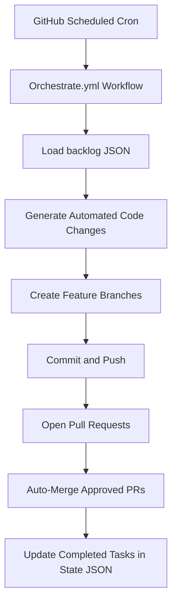

# Data Engineering Project Evolver

**Data Engineering Project Evolver** is a production-grade, end-to-end data engineering platform that demonstrates a complete workflow encompassing **data ingestion, transformation, validation, machine learning, model serving, visualization, and reproducible infrastructure**. Designed for enterprise standards, it provides a blueprint for scalable, maintainable, and automated data pipelines with robust testing, CI/CD, and observability.

---

## Overview

This platform simulates a **full-stack e-commerce analytics pipeline** with the following enterprise-grade capabilities:

* **Data Ingestion**: Java-based generator produces high-volume, synthetic CSV sales data suitable for testing and benchmarking.
* **ETL Pipelines**: PySpark workflows normalize, aggregate, and transform raw data into structured, analytics-ready Parquet datasets.
* **Data Quality**: Great Expectations enforces schema validation, constraints, and anomaly detection to ensure reliability of downstream analytics.
* **Machine Learning Lifecycle**: MLflow manages experiments, tracks metrics, and stores reproducible artifacts for model development.
* **Model Serving**: FastAPI exposes predictive models with versioned REST endpoints, enabling reliable integration with external services.
* **Visualization**: Streamlit dashboards provide interactive, enterprise-ready business insights.
* **Infrastructure as Code**: Terraform provisions Postgres, MinIO, Redis, and other local/cloud services reproducibly.
* **Automated Testing & CI/CD**: Unit tests, type hints, logging, and GitHub Actions pipelines guarantee maintainability and production readiness.
* **Observability**: Logging, structured error handling, and artifact tracking support monitoring and auditing of data workflows.

---

## Repository Structure

```text
.
├── .github/
│   └── workflows/           # CI/CD pipelines and automation
├── api/                     # FastAPI model serving
├── dashboard/               # Streamlit dashboards for visualization
├── data_pipelines/          # PySpark ETL jobs
├── infra/                   # Terraform infrastructure code
├── java_generator/          # Java data generator (Maven project)
├── mlflow/                  # MLflow experiments and artifacts
├── quality/                 # Great Expectations validation suites
├── scripts/                 # Orchestration and utility scripts
├── tests/                   # Pytest suite
├── state/                   # JSON state for task tracking
├── .gitignore               # Standard ignores
└── requirements.txt         # Python dependencies
```

---

## Getting Started

### Prerequisites

* Python 3.11+
* Java 11+ with Maven
* Terraform ≥0.13 (optional for infrastructure deployment)
* Docker (for local services)
* Git with SSH or HTTPS access

### Installation

```bash
git clone https://github.com/<your-username>/data-engineering-evolver.git
cd data-engineering-evolver

# Python environment
python -m venv venv
source venv/bin/activate  # Windows: venv\Scripts\activate

# Install dependencies
pip install -r requirements.txt

# Build Java data generator
cd java_generator
mvn package
cd ..
```

---

## Running Components Locally

### 1. Generate Synthetic Data

```bash
cd java_generator
java -jar target/data-generator-1.0-SNAPSHOT.jar ../data/sample_sales.csv 1000
cd ..
```

### 2. Run ETL Pipelines

```bash
export ETL_INPUT=data/sample_sales.csv
export ETL_OUTPUT=data/parquet_output
python -m data_pipelines.etl
```

### 3. Validate Data Quality

```bash
export GE_DATA=data/sample_sales.csv
python -m quality.validate
```

### 4. Train Machine Learning Models

```bash
export MLFLOW_DATA=data/parquet_output
python -m mlflow.experiment
```

### 5. Serve Models via FastAPI

```bash
export MLFLOW_MODEL_PATH=mlruns/0/model
uvicorn api.main:app --reload --port 8000
```

Documentation: [http://localhost:8000/docs](http://localhost:8000/docs)

### 6. Launch Streamlit Dashboards

```bash
export DASHBOARD_DATA=data/sample_sales.csv
streamlit run dashboard/app.py
```

### 7. Deploy Infrastructure

```bash
cd infra
terraform init
terraform plan
terraform apply
cd ..
```

### 8. Execute Tests

```bash
pytest -v
```

All CI/CD pipelines automatically validate code quality, run tests, and ensure reproducibility.

---

## Architecture

### Data Flow (Enterprise-Ready)


**Description**: Data is generated synthetically, transformed for analytics, validated, tracked for ML reproducibility, served via REST APIs, and visualized for insights. Each stage is modular and enterprise-ready.

---

### Automation & Orchestration



**Description**: GitHub Actions orchestrates fully automated workflow management, from backlog ingestion to automated PR creation and merging, ensuring reproducible development and operational standards.

---

## Environment Variables

| Variable            | Purpose                    | Example                                                        |
| ------------------- | -------------------------- | -------------------------------------------------------------- |
| `GH_TOKEN`          | GitHub API token           | ghp_xxxxx                                                      |
| `GITHUB_REPOSITORY` | Repository name            | PC-User-Guest/data-engineering-evolver                         |
| `ETL_INPUT`         | Input CSV path             | data/sample_sales.csv                                          |
| `ETL_OUTPUT`        | Output Parquet path        | data/parquet_output                                            |
| `GE_DATA`           | Path for validation        | data/sample_sales.csv                                          |
| `MLFLOW_DATA`       | MLflow input data          | data/parquet_output                                            |
| `MLFLOW_MODEL_PATH` | MLflow model artifact path | mlruns/0/model                                                 |
| `API_URL`           | FastAPI endpoint           | [http://localhost:8000/predict](http://localhost:8000/predict) |
| `DASHBOARD_DATA`    | Streamlit dashboard input  | data/sample_sales.csv                                          |

---

## Quality, Observability & Security

* **Type-hinted Python code** with structured logging
* No hardcoded secrets; all credentials via environment variables
* **Unit-tested pipelines**, APIs, and ML workflows
* Modular and maintainable design
* Enterprise-grade CI/CD for reproducible deployments and audits
* Observability via MLflow artifact tracking and validation metrics

---

## Troubleshooting

* Ensure `__init__.py` exists for all Python packages
* Adjust FastAPI or Streamlit ports if conflicts occur
* Use pinned dependencies in `requirements.txt`
* Docker required for Terraform-based infrastructure provisioning

---

## Contributing

1. Create a feature branch: `git checkout -b feature/my-feature`
2. Implement your changes and commit
3. Push branch and open a Pull Request
4. Automated CI/CD validates and tests the submission

---

## License

MIT License

---

## About

This project provides a fully reproducible, enterprise-grade data engineering workflow. It integrates modern **data pipelines, ML lifecycle management, infrastructure as code, automation, validation, and visualization**, offering a production-ready reference architecture for scalable analytics platforms.
